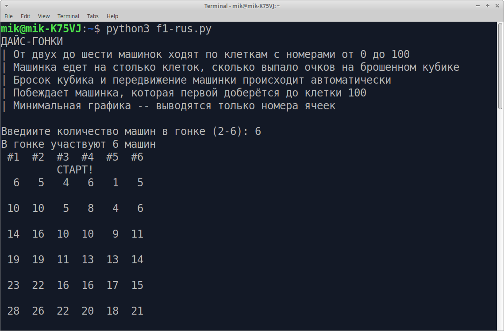

# Простые гонки с помощью игральной кости

* В основе игры передвижение фишек-машинок по клеткам с помощью игрального кубика (dice}
* Машинки ходят по клеткам с номерами от 0 до 100
* Для гонки можно выбрать от 2 до 6 машинок
* Машинка передвигантся на столько клеток, сколько выпадает очков на брошенном кубике
* Кубик бросается и машинка передвигается автоматически
* Побеждает машинка, которая первой доберётся до клетки №100
* Минимальная графика -- вывод только номеров ячеек
* Между ходами делается пауза, чтобы игрок оценил ситуацию




## Запуск игры

Требуется установленный интерпретатор Python 3.

Запуск английской версии:

    $ python3 f1.py

Запуск русской версии:

    $ python3 f1-rus.py


## Как этим насладиться

Машинки передвигаются автоматически. Вы, например, можете с другом делать ставки на победу одной из них.

Гонки можно просто наблюдать. Специально для этого делается пауза между ходами. Они обладают непредсказуемостью и драматизмом. Ниже пример такой гонки.


```
START
№1 №2
5 3     Машинка 1 уходит в отрыв
9 4
15 9
21 11
23 14
26 16
29 18
34 24
38 26
39 27
42 29
47 34   Отрыв достигает 13 очков
51 39   Машинка 2 начинает сокращать отрыв
52 45
57 46
60 52
61 56
64 57
66 59
67 65
69 68
70 70   Машинка 2 настигает соперника
71 74   Машинка 2 выходит вперёд
72 78
76 80
81 82
87 87   Машинки снова идут вровень
92 88   Победный рывок на финише машинки 1
98 91
100 94
FINISH
```


## Модификация

Код игры очень простой. Вы можете легко модифицировать его для большего числа машинок


## Лицензия

GPLv3 2020 Астапчик Михаил

