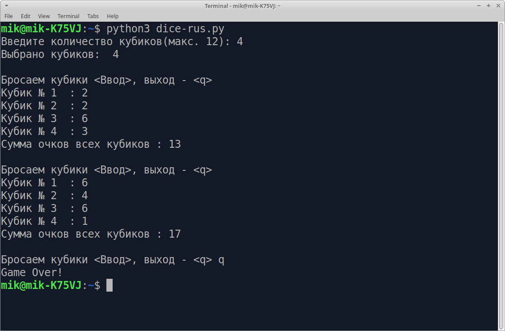

# "Игральные кубики" для командной строки

## dice.py

* Можно выбрать от 1 до 12 шестигранных кубиков
* После броска выводится очки на кубиках и общая сумма очков

### Запуск игры

Требуется установленный интерпретатор Python 3.

Запуск английской версии:

    $ python3 dice.py

Запуск русской версии:

    $ python3 dice-rus.py

## dicer.py

* Принимает один параметр -- количество кубиков
* После броска очки на кубиках выводится в стандартный вывод

      $ python3 dicer.py 5
      3 6 2 5 3

* Можно выбрать от 1 до 12 шестигранных кубиков

## Лицензия

GPLv3 2020 Астапчик Михаил
