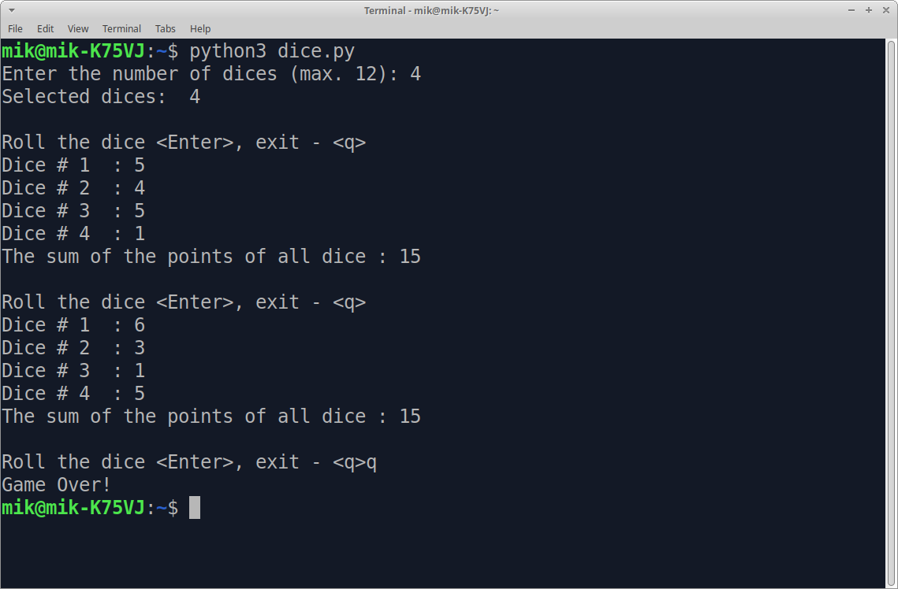

# Command line dice

**The merely dice. If you need dic for some other games **

## dice.py

* You can choose from 1 to 12 hex dice 
* After the roll, the points on the dice and the total amount of points are displayed 

### Launching the game

The game files: `dice.py` - English version, `dice-rus.py` - Russian version

Requires **Python 3** interpreter installed. Launch:

     $ python3 dice.py
 

## dicer.py

* Takes one parameter - the number of dice
* After rolling, dice points are printed to standard output

      $ python3 dicer.py 5
      3 6 2 5 3

* You can choose from 1 to 12 hex dice 

## dice.py

Dice on bash

    echo -e "1\n2\n3\n4\n5\n6" | shuf -n1

 ## License

GPLv3 2021 Astapchyk Mikhail

